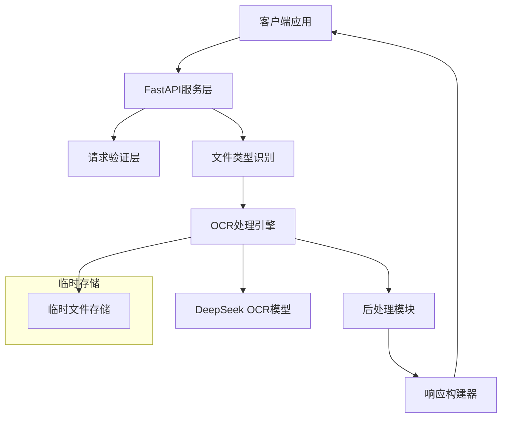

# Design Document

## Overview

本设计文档描述了一个基于FastAPI的OCR服务系统架构，该系统封装DeepSeek OCR-VLLM模型，提供单一RESTful API接口用于PDF和图片的OCR识别，通过文件后缀自动识别文件类型，同步返回Markdown格式内容并可选择返回位置边界框信息。

系统采用简化的同步处理架构，直接返回处理结果，具备完善的错误处理机制和性能优化策略。

## Architecture

### 系统架构图



### 核心组件架构

- **API Gateway**: FastAPI应用实例，处理HTTP请求路由
- **OCR Engine**: 封装DeepSeek OCR-VLLM模型的处理引擎
- **File Type Detector**: 根据文件后缀自动识别文件类型
- **File Handler**: 处理文件上传、验证和临时存储
- **Response Builder**: 构建标准化API响应格式

## Components and Interfaces

### 1. FastAPI应用层

```python
# 主要端点设计
POST /api/v1/ocr
GET /api/v1/health
```

#### 请求接口规范

**统一OCR接口**
```python
@app.post("/api/v1/ocr")
async def process_document(
    file: UploadFile,
    include_bbox: bool = False,
    crop_mode: bool = True,
    prompt: Optional[str] = None,
    page_range: Optional[str] = None  # 仅对PDF有效
) -> OCRResponse
```

接口根据上传文件的后缀名自动识别文件类型：
- 支持的图片格式：`.jpg`, `.jpeg`, `.png`, `.bmp`, `.tiff`
- 支持的PDF格式：`.pdf`

### 2. OCR处理引擎

```python
class OCREngine:
    def __init__(self):
        self.model = None  # DeepSeek OCR模型实例
        self.processor = None  # 图像处理器
        self.is_loaded = False
        
    def initialize(self):
        """初始化模型"""
        
    def process_document(self, file_path: str, config: OCRConfig) -> OCRResponse:
        """根据文件类型处理文档，返回完整结果"""
        
    def _process_image(self, image: PIL.Image, config: OCRConfig) -> OCRResult:
        """处理单张图片"""
        
    def _process_pdf(self, pdf_path: str, config: OCRConfig) -> List[OCRResult]:
        """处理PDF文档"""
        
    def _detect_file_type(self, file_path: str) -> str:
        """根据文件后缀检测文件类型"""
```

### 3. 数据模型

```python
class OCRConfig(BaseModel):
    include_bbox: bool = False
    crop_mode: bool = True
    prompt: Optional[str] = None
    max_image_size: int = 4096
    
class BoundingBox(BaseModel):
    x1: float
    y1: float
    x2: float
    y2: float
    label: str
    confidence: Optional[float] = None

class OCRResult(BaseModel):
    markdown_content: str
    processing_time: float
    page_number: Optional[int] = None
    bounding_boxes: Optional[List[BoundingBox]] = None
    
class OCRResponse(BaseModel):
    success: bool
    file_type: str  # "image" 或 "pdf"
    results: List[OCRResult]
    total_pages: Optional[int] = None
    processing_time: float
    error_message: Optional[str] = None
```

### 4. 文件处理模块

```python
class FileHandler:
    SUPPORTED_IMAGE_EXTENSIONS = {'.jpg', '.jpeg', '.png', '.bmp', '.tiff'}
    SUPPORTED_PDF_EXTENSIONS = {'.pdf'}
    
    @staticmethod
    def validate_file(file: UploadFile) -> Tuple[bool, str]:
        """验证文件格式和大小，返回(是否有效, 文件类型)"""
        
    @staticmethod
    def save_temp_file(file: UploadFile) -> str:
        """保存临时文件，返回文件路径"""
        
    @staticmethod
    def cleanup_temp_file(file_path: str):
        """清理单个临时文件"""
        
    @staticmethod
    def get_file_type(filename: str) -> str:
        """根据文件名获取文件类型"""
```

## Data Models

### 内存数据结构

```python
# 文件类型枚举
FileType = Enum('FileType', ['IMAGE', 'PDF'])

# 全局状态存储
class AppState:
    ocr_engine: OCREngine
    temp_dir: str
    max_file_size: int = 50 * 1024 * 1024  # 50MB
    
# 支持的文件格式
SUPPORTED_FORMATS = {
    'image': ['.jpg', '.jpeg', '.png', '.bmp', '.tiff'],
    'pdf': ['.pdf']
}
```

## Error Handling

### 错误分类和处理策略

1. **文件验证错误**
   - 不支持的文件格式: 400 Bad Request
   - 文件大小超限: 413 Payload Too Large
   - 文件损坏: 422 Unprocessable Entity

2. **处理错误**
   - 模型加载失败: 503 Service Unavailable
   - OCR处理失败: 500 Internal Server Error
   - 内存不足: 507 Insufficient Storage

3. **系统错误**
   - 服务器内部错误: 500 Internal Server Error
   - 服务不可用: 503 Service Unavailable

### 错误响应格式

```python
class ErrorResponse(BaseModel):
    success: bool = False
    error_code: str
    error_message: str
    details: Optional[Dict[str, Any]] = None
    timestamp: datetime
```

### 异常处理装饰器

```python
def handle_ocr_errors(func):
    """OCR处理错误装饰器"""
    def wrapper(*args, **kwargs):
        try:
            return func(*args, **kwargs)
        except Exception as e:
            # 记录错误并返回标准错误响应
            pass
    return wrapper
```

## Testing Strategy

### 单元测试

1. **API端点测试**
   - 使用pytest和httpx测试所有API端点
   - 模拟文件上传和各种参数组合
   - 验证响应格式和状态码

2. **OCR引擎测试**
   - 使用测试图片和PDF验证OCR功能
   - 测试不同配置参数的效果
   - 验证边界框提取的准确性

3. **文件处理测试**
   - 测试各种文件格式的验证逻辑
   - 测试文件大小限制
   - 测试临时文件清理机制

### 集成测试

1. **端到端测试**
   - 完整的文件上传到结果返回流程
   - 测试不同文件类型的自动识别
   - 验证同步响应的正确性

2. **性能测试**
   - 使用locust进行负载测试
   - 内存使用监控
   - 响应时间基准测试

### 测试数据

```python
# 测试用例数据结构
class TestCase:
    name: str
    input_file: str
    expected_output: Dict[str, Any]
    config: OCRConfig
    should_fail: bool = False
```

### 模拟和测试工具

```python
# OCR引擎模拟器（用于快速测试）
class MockOCREngine:
    def process_document(self, file_path, config) -> OCRResponse:
        return OCRResponse(
            success=True,
            file_type="image",
            results=[OCRResult(
                markdown_content="# Mock Result",
                processing_time=0.1,
                bounding_boxes=[] if not config.include_bbox else [
                    BoundingBox(x1=0, y1=0, x2=100, y2=50, label="title")
                ]
            )],
            processing_time=0.1
        )
```

## Performance Considerations

### 性能优化策略

1. **模型预加载**
   - 应用启动时预加载OCR模型
   - 使用模型缓存避免重复加载

2. **同步处理优化**
   - 优化模型推理速度
   - 减少内存分配和释放开销
   - 使用适当的批处理大小

3. **内存管理**
   - 及时清理临时文件
   - 优化图像预处理内存使用
   - 监控内存使用情况

4. **响应优化**
   - 压缩响应数据
   - 优化JSON序列化
   - 减少不必要的数据复制

### 监控和指标

```python
class Metrics:
    request_count: int = 0
    processing_time_avg: float = 0.0
    error_rate: float = 0.0
    memory_usage: float = 0.0
    image_requests: int = 0
    pdf_requests: int = 0
```

### 配置管理

```python
class Settings(BaseSettings):
    # 服务配置
    host: str = "0.0.0.0"
    port: int = 8000
    debug: bool = False
    
    # OCR配置
    model_path: str = "deepseek-ai/DeepSeek-OCR"
    max_file_size: int = 50 * 1024 * 1024
    
    # 存储配置
    temp_dir: str = "/tmp/ocr_temp"
    cleanup_interval: int = 3600  # 1小时
    
    class Config:
        env_file = ".env"
```

这个设计提供了一个完整、可扩展的OCR服务架构，支持高并发处理、完善的错误处理和性能优化。